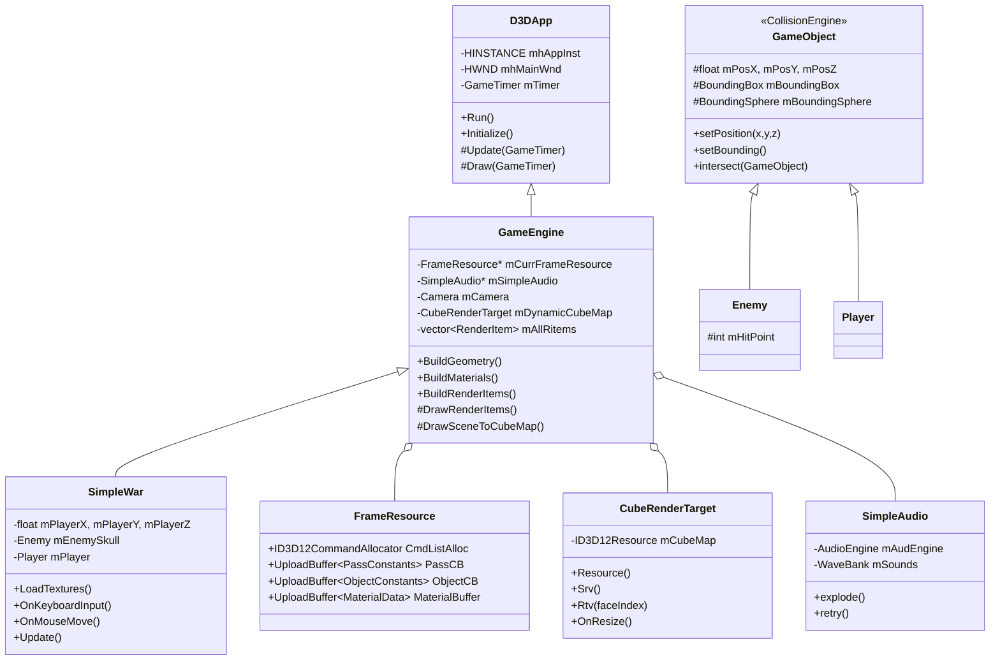

# The3DShootingGame (SimpleWar)

むかしDirectX12でつくったC++ゲーム

## プロジェクト構成

```
The3DShootingGame/
├── Common/                    # 共通基盤・ユーティリティ
│   ├── d3dApp.h/cpp           # DirectX12 アプリケーション基底クラス
│   ├── d3dUtil.h/cpp          # D3Dユーティリティ、MeshGeometry, Material, Texture 等
│   ├── d3dx12.h               # D3D12 ヘルパー
│   ├── Camera.h/cpp           # カメラ（視点・視野）
│   ├── GameTimer.h/cpp        # ゲームタイマー
│   ├── GeometryGenerator.h/cpp # ジオメトリ生成
│   ├── MathHelper.h/cpp       # 数学ヘルパー
│   ├── UploadBuffer.h         # GPU定数バッファ用アップロードバッファ
│   └── DDSTextureLoader.h/cpp # DDSテクスチャローダー
│
├── SimpleWar/
│   └── SimpleWar/             # ゲーム本体
│       ├── SimpleWar.h/cpp    # メインゲームクラス（エントリポイント）
│       ├── GameEngine.h/cpp   # ゲームエンジン（レンダリング・更新ループ）
│       ├── FrameResource.h/cpp # フレームリソース（CB、コマンドアロケータ）
│       ├── CubeRenderTarget.h/cpp # キューブマップ（動的反射用）
│       ├── CollisionEngine.h  # 当たり判定エンジン（GameObject）
│       ├── Enemy.h            # 敵クラス
│       ├── Player.h           # プレイヤークラス（※GameObject継承）
│       ├── SimpleAudio.h/cpp  # オーディオ管理
│       ├── SimpleObject.h     # （未使用）
│       ├── constants.h        # 定数
│       ├── Shaders/           # HLSLシェーダー
│       │   ├── Default.hlsl
│       │   ├── Sky.hlsl
│       │   ├── Common.hlsl
│       │   └── LightingUtil.hlsl
│       ├── Models/            # モデルデータ
│       │   ├── skull.txt
│       │   └── car.txt
│       └── packages/          # DirectXTK12 等 NuGet パッケージ
│
└── README.md
```

## クラスダイアグラム

```
┌─────────────────────────────────────────────────────────────────────────────────┐
│                              アプリケーション層                                    │
├─────────────────────────────────────────────────────────────────────────────────┤
│                                                                                  │
│  ┌──────────────┐         ┌──────────────────┐                                  │
│  │   D3DApp     │         │    SimpleWar      │                                  │
│  │ (Common)     │◄────────│  (ゲーム本体)     │                                  │
│  └──────┬───────┘         └────────┬─────────┘                                  │
│         │                          │                                              │
│         │ 継承                     │ 継承                                         │
│         ▼                          ▼                                              │
│  ┌──────────────┐         ┌──────────────────┐                                  │
│  │  GameEngine  │◄────────│                  │                                  │
│  │ (レンダリング) │         │                  │                                  │
│  └──────┬───────┘         └──────────────────┘                                  │
│         │                                                                        │
│         │ 所有                                                                   │
│         ├──► FrameResource (複数)                                                │
│         ├──► CubeRenderTarget (動的キューブマップ)                                 │
│         ├──► SimpleAudio                                                         │
│         ├──► Camera, mCubeMapCamera[6]                                           │
│         ├──► RenderItem (mAllRitems)                                              │
│         └──► MeshGeometry, Material, Texture, PSO 等                             │
│                                                                                  │
└─────────────────────────────────────────────────────────────────────────────────┘

┌─────────────────────────────────────────────────────────────────────────────────┐
│                              ゲームオブジェクト層                                  │
├─────────────────────────────────────────────────────────────────────────────────┤
│                                                                                  │
│  ┌─────────────────────────────────────┐                                        │
│  │  CollisionEngine::GameObject         │                                        │
│  │  (当たり判定基底)                     │                                        │
│  │  - mPosX, mPosY, mPosZ               │                                        │
│  │  - BoundingBox, BoundingSphere 等    │                                        │
│  │  - setPosition(), setBounding()      │                                        │
│  │  - intersect()                       │                                        │
│  └──────────────┬──────────────────────┘                                        │
│                 │                                                                │
│         ┌───────┴───────┐                                                        │
│         │ 継承          │ 継承                                                    │
│         ▼              ▼                                                         │
│  ┌──────────────┐  ┌──────────────┐                                              │
│  │    Enemy     │  │    Player    │                                              │
│  │  (敵)        │  │  (プレイヤー)  │                                              │
│  │ - mHitPoint  │  │              │                                              │
│  └──────────────┘  └──────────────┘                                              │
│                                                                                  │
└─────────────────────────────────────────────────────────────────────────────────┘

┌─────────────────────────────────────────────────────────────────────────────────┐
│                              レンダリング・リソース層                              │
├─────────────────────────────────────────────────────────────────────────────────┤
│                                                                                  │
│  ┌──────────────────┐  ┌──────────────────┐  ┌──────────────────┐            │
│  │  CubeRenderTarget │  │  FrameResource   │  │    RenderItem     │            │
│  │  (キューブマップ)  │  │  (フレーム同期)   │  │  (描画アイテム)    │            │
│  │  - 6面RTV        │  │  - CmdListAlloc   │  │  - World, Mat, Geo │            │
│  │  - SRV/RTV       │  │  - PassCB         │  │  - ObjCBIndex     │            │
│  └──────────────────┘  │  - ObjectCB       │  └──────────────────┘            │
│                         │  - MaterialBuffer │                                    │
│  ┌──────────────────┐  └──────────────────┘  ┌──────────────────┐            │
│  │     Camera       │                         │  UploadBuffer<T>  │            │
│  │  (視点・視野)    │                         │  (定数バッファ)    │            │
│  └──────────────────┘                         └──────────────────┘            │
│                                                                                  │
└─────────────────────────────────────────────────────────────────────────────────┘

┌─────────────────────────────────────────────────────────────────────────────────┐
│                              オーディオ・ユーティリティ層                          │
├─────────────────────────────────────────────────────────────────────────────────┤
│                                                                                  │
│  ┌──────────────────┐  ┌──────────────────┐  ┌──────────────────┐            │
│  │   SimpleAudio    │  │  d3dUtil         │  │  MathHelper      │            │
│  │  - explode()     │  │  - CalcCBByteSize│  │  - Identity4x4   │            │
│  │  - retry()       │  │  - LoadBinary    │  │  - Pi 等          │            │
│  └──────────────────┘  └──────────────────┘  └──────────────────┘            │
│                                                                                  │
└─────────────────────────────────────────────────────────────────────────────────┘
```

## Mermaid クラス図



## 主要なデータフロー

1. **初期化**: `WinMain` → `SimpleWar::Initialize` → `GameEngine::Initialize` → ジオメトリ・マテリアル・テクスチャ構築
2. **メインループ**: `D3DApp::Run` → `Update` → `Draw`（毎フレーム）
3. **当たり判定**: `SimpleWar::Update` 内で `mPlayer.intersect(mEnemySkull)` を呼び出し
4. **レンダリング**: `Draw` → `DrawSceneToCubeMap`（キューブマップ）→ `DrawRenderItems`（各レイヤー描画）

## 使用技術

### 技術スタック

| カテゴリ | 技術 |
|---------|------|
| **言語** | C++17 |
| **グラフィックスAPI** | DirectX 12 |
| **シェーダー** | HLSL (Shader Model 5.1) |
| **数学** | DirectXMath (XMVECTOR, XMMATRIX) |
| **オーディオ** | DirectXTK12 Audio (AudioEngine, WaveBank) |
| **当たり判定** | DirectXCollision (BoundingBox, BoundingSphere) |
| **ビルド** | MSBuild (Visual Studio) |

### グラフィックス技術

- **動的キューブマップ**: 反射オブジェクト用に6面レンダリング（`CubeRenderTarget`）
- **マルチパスレンダリング**: Opaque → OpaqueDynamicReflectors → Sky のレイヤー分離
- **PBR風ライティング**: Blinn-Phong + Schlick Fresnel によるスペキュラ計算
- **マテリアルシステム**: DiffuseAlbedo, FresnelR0, Roughness による物理ベース風シェーディング
- **テクスチャ配列**: `Texture2D gDiffuseMap[4]` による複数テクスチャの動的インデックス参照
- **StructuredBuffer**: マテリアルデータのGPU側ストリーミング（`gMaterialData`）

### レンダリングパイプライン

1. **フレームリソース**: 3フレーム分の CommandAllocator / PassCB / ObjectCB / MaterialBuffer をリングバッファで管理
2. **フェンス同期**: GPU完了待ちでCPU-GPU同期、描画完了まで次のフレームリソースを再利用しない
3. **ルートシグネチャ**: DescriptorTable（テクスチャ）+ RootDescriptor（MaterialBuffer）のハイブリッドバインディング
4. **定数バッファ**: 256バイトアラインメントの `UploadBuffer<T>` でCPU→GPU転送

### 当たり判定

- **DirectXCollision**: `BoundingBox`, `BoundingSphere`, `BoundingFrustum`, `BoundingOrientedBox` をサポート
- **GameObject**: 位置・バウンディング形状を保持し、`intersect()` で他オブジェクトとの衝突判定
- **形状タイプ**: `IS_BOX` / `IS_SPHERE` による Box-Box, Box-Sphere, Sphere-Sphere の組み合わせ判定

### オーディオ

- **DirectXTK12 Audio**: `AudioEngine` + `WaveBank`（.xwb）によるサウンド再生
- **BGM**: `SoundEffectInstance` でループ再生（`rao`）
- **効果音**: `WaveBank::Play()` で爆発音（`Explo1`）等を再生

### その他

- **ジオメトリ**: `GeometryGenerator`（プリミティブ）+ カスタムモデル（skull.txt, car.txt）
- **テクスチャ**: DDS形式（`DDSTextureLoader`）
- **入力**: `GetAsyncKeyState` によるキーボード、マウスメッセージ（`OnMouseMove` 等）

## ビルド

- Visual Studio 2017 以降（v141 ツールセット）
- Windows 10 SDK
- DirectX 12
- DirectXTK12（NuGet パッケージ）

プロジェクトファイル: `SimpleWar/SimpleWar/DynamicCube.sln`
